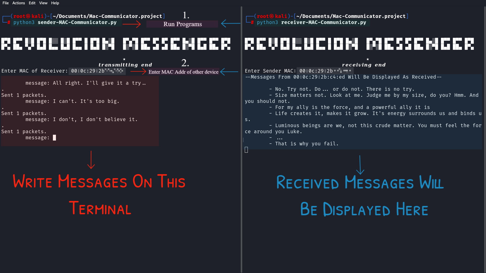
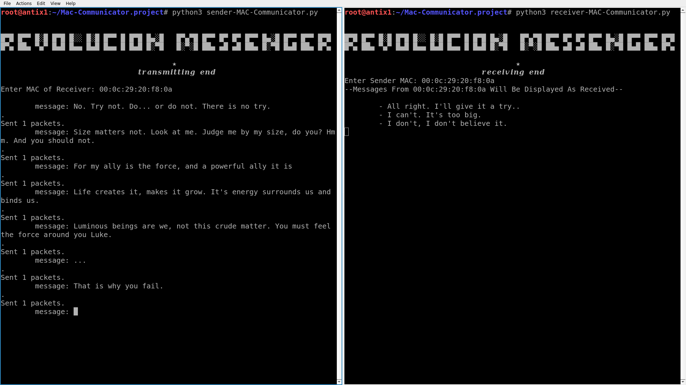

# _Revolución_ _Messenger_- Chat Over L2

Simple Chat application that works over Data-Link Layer (Layer 2)  of OSI Model, It doesn't touch the IP Layer (Layer 3).

 ## Table Of Contents
 

 - [Introduction](#Introduction)
 - [Technologies Used](#technologies_used)
 - [Usage](#usage)

## Introduction
The idea for this app originated as I was learning networking, where my instructor told me that MAC Addresses are used to communicate within a LAN, While IPs are used to communicate between two different networks. 
I needed to put this into perspective, and the result is this. The project works by sending Ethernet packets directly over LAN. 

The project is a two-program package ( >< ! ). One receiver and one sender. This is due to the fact that I had problems taking input and giving output at the same time in Python. ＞﹏＜. 

## Technologies Used

 - Python 3
 - Python's Scapy Module

## Usage

 

 1. Install Python 3
 2. Install Scapy module in Python -
 
	 `pip3 install --pre scapy[basic]`
3. Clone  the repository.
	

    `git clone https://github.com/LoneWolf4713/Revolución-Messenger/`
 4. Open two terminals and open both programs in each terminal.
  
	 `python3 sender-MAC-Communicator.py` - to open transmitting program
	 
	 `python3 receiver-MAC-Communicator.py` - to open receiving program
	 
	**I have two machines here. One is my Kali machine and other is AntiX Linux**
		 
	!
	Do the same for the other machine as well -
	 
	

> ***Caution: - First ALWAYS open up both the programs on each computer/node and then proceed to chat.***
4. Tada! You Successfully Utilized this project to chat directly over MAC Addresses. This somewhat proves that you don't IP Addresses to exchange messages within a LAN. 
## Project Status

Well, I had already told you that I am making this while I'm still learning Networking and a lot of other stuff! Including Python, Linux and much more. So this program is bound to have many bugs and drawbacks and other negative things. 
Please feel free to write to me anything about it at pratyakshk13@gmail.com.
As Always, your ideas are  welcome! 
.
.
B'bye Fellow Internet Traveler! 
Hasta La Victoria Siempre! 
 

